# Admin Dashboard Project Analysis

## 1. Folder Structure & Role

The `app/(dashboard)` directory contains the main application pages, structured by feature. Each folder represents a distinct feature/route group.

- **address**: Handles features related to address.
- **administrator**: Handles features related to administrator.
- **appearance**: Handles features related to appearance.
- **billing**: Handles features related to billing.
- **blog**: Handles features related to blog.
- **blog-category**: Handles features related to blog category.
- **category**: Handles features related to category.
- **competition**: Handles features related to competition.
- **dashboard**: Handles features related to dashboard.
- **game**: Handles features related to game.
- **game-sessions**: Handles features related to game sessions.
- **games**: Handles features related to games.
- **groups**: Handles features related to groups.
- **manage-blog**: Handles features related to manage blog.
- **manage-competitions**: Handles features related to manage competitions.
- **manage-games**: Handles features related to manage games.
- **manage-sessions**: Handles features related to manage sessions.
- **master**: Handles features related to master.
- **profiles**: Handles features related to profiles.
- **quiz**: Handles features related to quiz.
- **quiz-approval**: Handles features related to quiz approval.
- **quizzes**: Handles features related to quizzes.
- **receptionist**: Handles features related to receptionist.
- **rejection-templates**: Handles features related to rejection templates.
- **reports**: Handles features related to reports.
- **settings**: Handles features related to settings.
- **subscriptions**: Handles features related to subscriptions.
- **support**: Handles features related to support.
- **trash-bin**: Handles features related to trash bin.
- **users**: Handles features related to users.

## 2. Pages, Features, and Supabase Connections

### ADDRESS

**Files connected/used:**
- `app/(dashboard)/address/city/_components/city-columns.tsx`
- `app/(dashboard)/address/city/_hooks/use-cities-table.ts`
- `app/(dashboard)/address/city/actions.ts`
- `app/(dashboard)/address/city/city-table.tsx`
- `app/(dashboard)/address/city/page.tsx`
- `app/(dashboard)/address/country/_components/country-columns.tsx`
- `app/(dashboard)/address/country/_hooks/use-countries-table.ts`
- `app/(dashboard)/address/country/actions.ts`
- `app/(dashboard)/address/country/country-table.tsx`
- `app/(dashboard)/address/country/page.tsx`
- `app/(dashboard)/address/state/_components/state-columns.tsx`
- `app/(dashboard)/address/state/_hooks/use-states-table.ts`
- `app/(dashboard)/address/state/actions.ts`
- `app/(dashboard)/address/state/page.tsx`
- `app/(dashboard)/address/state/state-table.tsx`

**Supabase Connections:**
- **Tables:** cities, countries, states
- **Columns Selected/Manipulated:** iso2, *, region, country_code

**Illustration (DB Connection):**
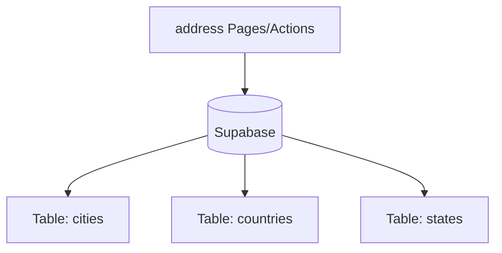

---

### ADMINISTRATOR

**Files connected/used:**
- `app/(dashboard)/administrator/dashboard/page.tsx`

*No direct Supabase `.from()` usage detected in this directory. It might rely on APIs, context, or hooks from other directories.*

---

### APPEARANCE

**Files connected/used:**
- `app/(dashboard)/appearance/_components/theme-card.tsx`
- `app/(dashboard)/appearance/_hooks/use-appearance.ts`
- `app/(dashboard)/appearance/page.tsx`

*No direct Supabase `.from()` usage detected in this directory. It might rely on APIs, context, or hooks from other directories.*

---

### BILLING

**Files connected/used:**
- `app/(dashboard)/billing/dashboard/page.tsx`

*No direct Supabase `.from()` usage detected in this directory. It might rely on APIs, context, or hooks from other directories.*

---

### BLOG

**Files connected/used:**
- `app/(dashboard)/blog/dashboard/page.tsx`

*No direct Supabase `.from()` usage detected in this directory. It might rely on APIs, context, or hooks from other directories.*

---

### BLOG-CATEGORY

**Files connected/used:**
- `app/(dashboard)/blog-category/_components/blog-category-client.tsx`
- `app/(dashboard)/blog-category/page.tsx`

*No direct Supabase `.from()` usage detected in this directory. It might rely on APIs, context, or hooks from other directories.*

---

### CATEGORY

**Files connected/used:**
- `app/(dashboard)/category/_components/category-columns.tsx`
- `app/(dashboard)/category/_components/category-dialogs.tsx`
- `app/(dashboard)/category/_components/category-table.tsx`
- `app/(dashboard)/category/_hooks/use-category-table.ts`
- `app/(dashboard)/category/actions.ts`
- `app/(dashboard)/category/page.tsx`

*No direct Supabase `.from()` usage detected in this directory. It might rely on APIs, context, or hooks from other directories.*

---

### COMPETITION

**Files connected/used:**
- `app/(dashboard)/competition/dashboard/page.tsx`

*No direct Supabase `.from()` usage detected in this directory. It might rely on APIs, context, or hooks from other directories.*

---

### DASHBOARD

**Files connected/used:**
- `app/(dashboard)/dashboard/_components/activity-columns.tsx`
- `app/(dashboard)/dashboard/_components/dashboard-charts.tsx`
- `app/(dashboard)/dashboard/_components/dashboard-stats-grid.tsx`
- `app/(dashboard)/dashboard/page.tsx`

*No direct Supabase `.from()` usage detected in this directory. It might rely on APIs, context, or hooks from other directories.*

---

### GAME

**Files connected/used:**
- `app/(dashboard)/game/dashboard/_components/game-dashboard-skeleton.tsx`
- `app/(dashboard)/game/dashboard/_components/horizontal-bar-chart.tsx`
- `app/(dashboard)/game/dashboard/_components/kpi-cards.tsx`
- `app/(dashboard)/game/dashboard/_hooks/use-game-dashboard.ts`
- `app/(dashboard)/game/dashboard/actions.ts`
- `app/(dashboard)/game/dashboard/dashboard-filter.tsx`
- `app/(dashboard)/game/dashboard/game-dashboard-client.tsx`
- `app/(dashboard)/game/dashboard/game-dashboard-wrapper.tsx`
- `app/(dashboard)/game/dashboard/loading.tsx`
- `app/(dashboard)/game/dashboard/page.tsx`

**Supabase Connections:**
- **Tables:** game_sessions, profiles, quizzes
- **Columns Selected/Manipulated:** created_at, total_time_minutes, application, host_id, participants, current_questions, quiz_id, id, fullname, username, avatar_url, id, category

**Illustration (DB Connection):**
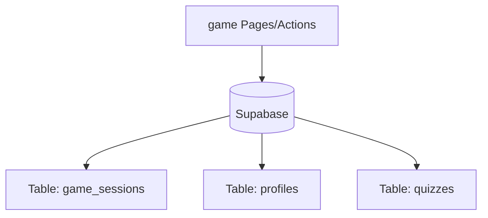

---

### GAME-SESSIONS

**Files connected/used:**
- `app/(dashboard)/game-sessions/[id]/page.tsx`
- `app/(dashboard)/game-sessions/[id]/session-stats.tsx`
- `app/(dashboard)/game-sessions/[id]/statistic-button.tsx`
- `app/(dashboard)/game-sessions/_components/game-session-columns.tsx`
- `app/(dashboard)/game-sessions/_components/game-session-dialogs.tsx`
- `app/(dashboard)/game-sessions/_hooks/use-game-sessions-table.ts`
- `app/(dashboard)/game-sessions/actions.ts`
- `app/(dashboard)/game-sessions/game-sessions-table.tsx`
- `app/(dashboard)/game-sessions/page.tsx`

**Supabase Connections:**
- **Tables:** game_sessions, profiles, quizzes
- **Columns Selected/Manipulated:** id, fullname, username, avatar_url, id, category, *, title, category, id, avatar_url

**Illustration (DB Connection):**
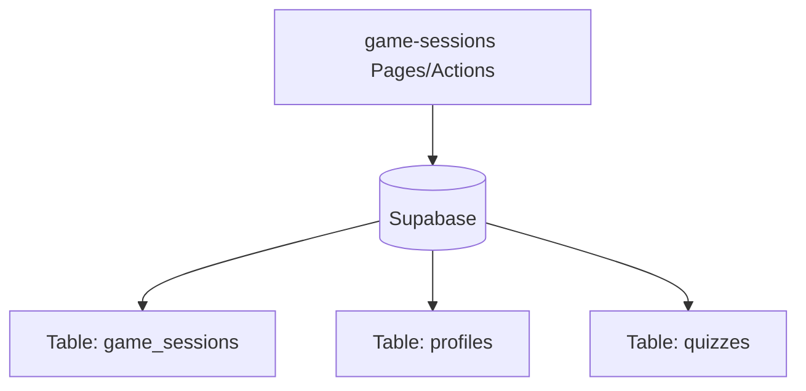

---

### GAMES

**Files connected/used:**
- `app/(dashboard)/games/[name]/actions.ts`
- `app/(dashboard)/games/[name]/page.tsx`
- `app/(dashboard)/games/[name]/player-map.tsx`
- `app/(dashboard)/games/_components/game-card.tsx`
- `app/(dashboard)/games/_hooks/use-games.ts`
- `app/(dashboard)/games/actions.ts`
- `app/(dashboard)/games/page.tsx`

**Supabase Connections:**
- **Tables:** game_sessions, profiles, countries
- **Columns Selected/Manipulated:** id, quiz_id, host_id, game_pin, status, difficulty, total_time_minutes, participants, quiz_detail, created_at, started_at, ended_at, participants, country_id, grade, gender, id, name, iso3, numeric_code, latitude, longitude, application, status, host_id, participants, created_at

**Illustration (DB Connection):**
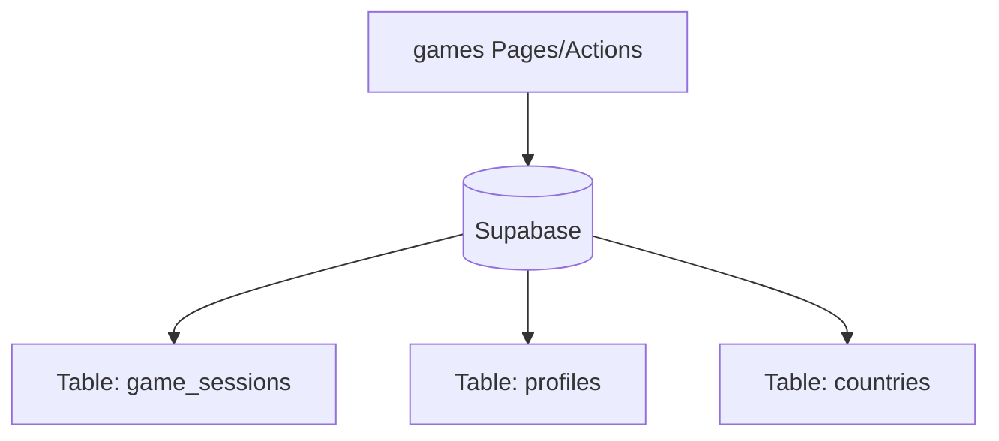

---

### GROUPS

**Files connected/used:**
- `app/(dashboard)/groups/[id]/group-detail-client.tsx`
- `app/(dashboard)/groups/[id]/page.tsx`
- `app/(dashboard)/groups/_components/group-card.tsx`
- `app/(dashboard)/groups/_components/group-dialogs.tsx`
- `app/(dashboard)/groups/_hooks/use-groups-table.ts`
- `app/(dashboard)/groups/actions.ts`
- `app/(dashboard)/groups/group-table.tsx`
- `app/(dashboard)/groups/page.tsx`
- `app/(dashboard)/groups/stats-actions.ts`

**Supabase Connections:**
- **Tables:** states, cities, groups, profiles, countries
- **Columns Selected/Manipulated:** id, name, country_id, id, name, state_id, *, creator:profiles!groups_creator_id_fkey(fullname, email, avatar_url, username, state:states(name), city:cities(name)), id, fullname, username, avatar_url, members, id, name, iso2, emoji, category

**Illustration (DB Connection):**
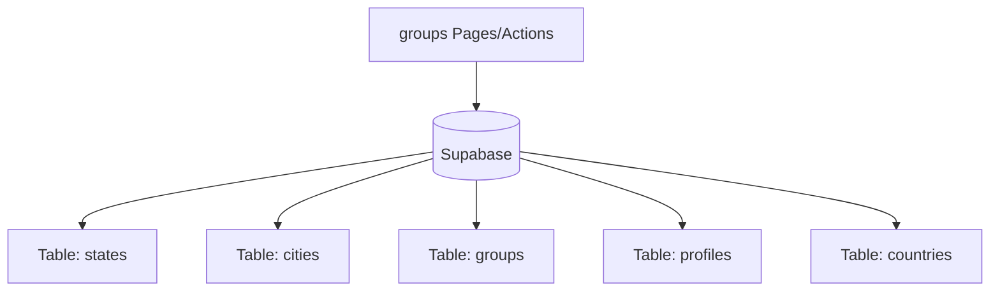

---

### MANAGE-BLOG

**Files connected/used:**
- `app/(dashboard)/manage-blog/[id]/page.tsx`
- `app/(dashboard)/manage-blog/_components/manage-blog-columns.tsx`
- `app/(dashboard)/manage-blog/_components/manage-blog-dialogs.tsx`
- `app/(dashboard)/manage-blog/_components/manage-blog-form.tsx`
- `app/(dashboard)/manage-blog/_hooks/use-manage-blog-table.ts`
- `app/(dashboard)/manage-blog/add/page.tsx`
- `app/(dashboard)/manage-blog/manage-blog-client.tsx`
- `app/(dashboard)/manage-blog/page.tsx`

**Supabase Connections:**
- **Tables:** blogs, blog-images
- **Columns Selected/Manipulated:** *

**Illustration (DB Connection):**
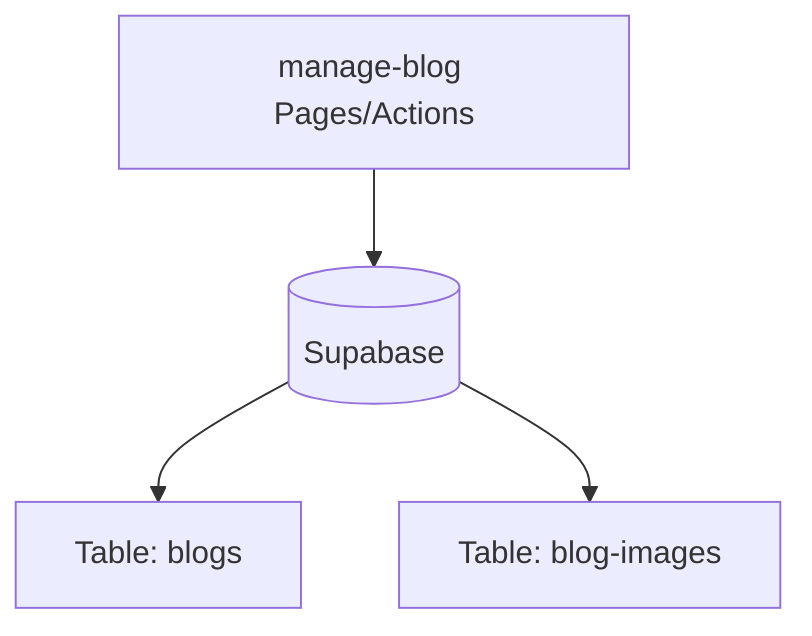

---

### MANAGE-COMPETITIONS

**Files connected/used:**
- `app/(dashboard)/manage-competitions/[id]/_components/assign-participants-dialog.tsx`
- `app/(dashboard)/manage-competitions/[id]/_components/bracket-view.tsx`
- `app/(dashboard)/manage-competitions/[id]/_components/group-card.tsx`
- `app/(dashboard)/manage-competitions/[id]/_components/local-bracket-view.tsx`
- `app/(dashboard)/manage-competitions/[id]/_components/phase-completed.tsx`
- `app/(dashboard)/manage-competitions/[id]/_components/phase-group-stage.tsx`
- `app/(dashboard)/manage-competitions/[id]/_components/phase-payment.tsx`
- `app/(dashboard)/manage-competitions/[id]/_components/phase-qualification.tsx`
- `app/(dashboard)/manage-competitions/[id]/_components/phase-registration.tsx`
- `app/(dashboard)/manage-competitions/[id]/_components/phase-stepper.tsx`
- `app/(dashboard)/manage-competitions/[id]/_components/round-manager.tsx`
- `app/(dashboard)/manage-competitions/[id]/actions.ts`
- `app/(dashboard)/manage-competitions/[id]/edit/page.tsx`
- `app/(dashboard)/manage-competitions/[id]/page.tsx`
- `app/(dashboard)/manage-competitions/_components/competition-columns.tsx`
- `app/(dashboard)/manage-competitions/_components/competition-dialogs.tsx`
- `app/(dashboard)/manage-competitions/_hooks/use-competitions-table.ts`
- `app/(dashboard)/manage-competitions/add/page.tsx`
- `app/(dashboard)/manage-competitions/manage-competitions-client.tsx`
- `app/(dashboard)/manage-competitions/page.tsx`

**Supabase Connections:**
- **Tables:** competition_groups, competition_participants, quizzes, groups, game_sessions, notifications, competitions, profiles, competition_group_members
- **Columns Selected/Manipulated:** rounds, id, user_id, id, title, description, category, language, image_url, profiles ( username, avatar_url ), *, id, id, fullname, username, avatar_url, id, participants, id, participants, created_at, status, application, quiz_detail, id, title, questions, is_public, creator_id, application

**Illustration (DB Connection):**
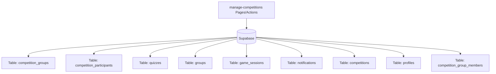

---

### MANAGE-GAMES

**Files connected/used:**
- `app/(dashboard)/manage-games/[id]/page.tsx`
- `app/(dashboard)/manage-games/_components/manage-game-form.tsx`
- `app/(dashboard)/manage-games/_components/manage-games-columns.tsx`
- `app/(dashboard)/manage-games/_components/manage-games-dialogs.tsx`
- `app/(dashboard)/manage-games/_hooks/use-manage-games-table.ts`
- `app/(dashboard)/manage-games/add/page.tsx`
- `app/(dashboard)/manage-games/manage-games-client.tsx`
- `app/(dashboard)/manage-games/page.tsx`

**Supabase Connections:**
- **Tables:** master_games
- **Columns Selected/Manipulated:** *

**Illustration (DB Connection):**
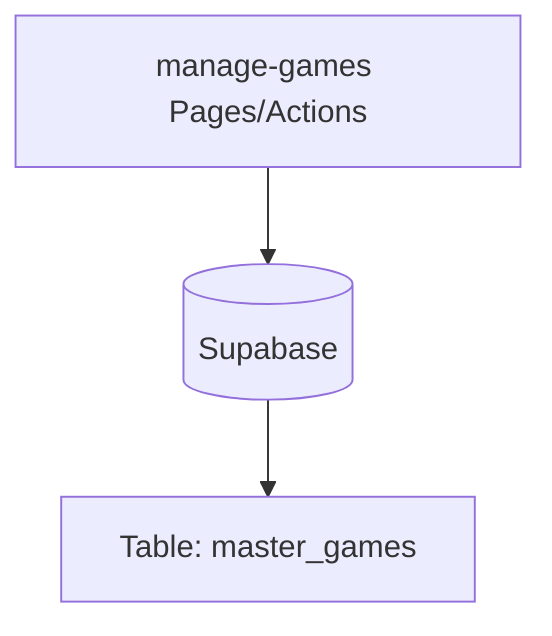

---

### MANAGE-SESSIONS

**Files connected/used:**
- `app/(dashboard)/manage-sessions/_components/manage-sessions-columns.tsx`
- `app/(dashboard)/manage-sessions/_hooks/use-manage-sessions-table.ts`
- `app/(dashboard)/manage-sessions/actions.ts`
- `app/(dashboard)/manage-sessions/manage-sessions-table.tsx`
- `app/(dashboard)/manage-sessions/page.tsx`

**Supabase Connections:**
- **Tables:** game_sessions, profiles, notifications
- **Columns Selected/Manipulated:** id, game_pin, quiz_id, host_id, created_at, participants, application, quiz_detail, status, id, fullname, username, avatar_url

**Illustration (DB Connection):**
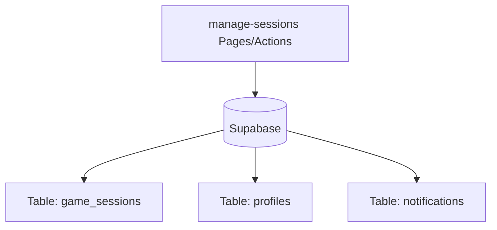

---

### MASTER

**Files connected/used:**
- `app/(dashboard)/master/dashboard/actions.ts`
- `app/(dashboard)/master/dashboard/page.tsx`

**Supabase Connections:**
- **Tables:** countries, states, cities, profiles
- **Columns Selected/Manipulated:** id, name

**Illustration (DB Connection):**
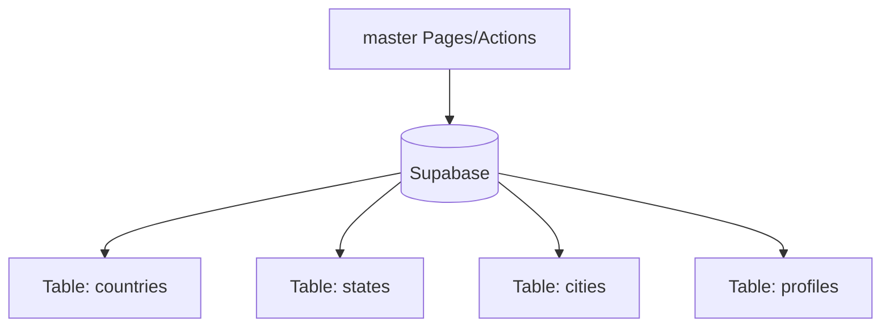

---

### PROFILES

**Files connected/used:**
- `app/(dashboard)/profiles/[id]/_components/profile-client.tsx`
- `app/(dashboard)/profiles/[id]/page.tsx`
- `app/(dashboard)/profiles/[id]/profile-client.tsx`
- `app/(dashboard)/profiles/[id]/profile-view.tsx`
- `app/(dashboard)/profiles/actions.ts`

**Supabase Connections:**
- **Tables:** profiles, follows, friendships, countries, states, cities, game_sessions, quizzes
- **Columns Selected/Manipulated:** *, id, name, latitude, longitude, quiz_id, participants, id, title, id, title, category, questions, created_at

**Illustration (DB Connection):**
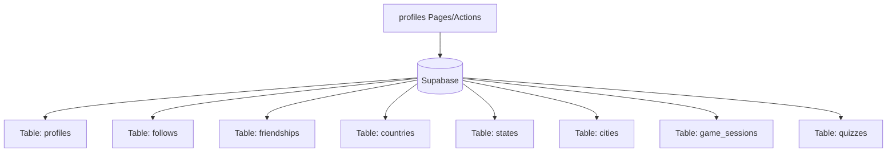

---

### QUIZ

**Files connected/used:**
- `app/(dashboard)/quiz/dashboard/page.tsx`

*No direct Supabase `.from()` usage detected in this directory. It might rely on APIs, context, or hooks from other directories.*

---

### QUIZ-APPROVAL

**Files connected/used:**
- `app/(dashboard)/quiz-approval/[id]/page.tsx`
- `app/(dashboard)/quiz-approval/_components/quiz-approval-columns.tsx`
- `app/(dashboard)/quiz-approval/_components/quiz-approval-dialogs.tsx`
- `app/(dashboard)/quiz-approval/_hooks/use-quiz-approval-table.ts`
- `app/(dashboard)/quiz-approval/actions.ts`
- `app/(dashboard)/quiz-approval/page.tsx`
- `app/(dashboard)/quiz-approval/quiz-approval-table.tsx`

*No direct Supabase `.from()` usage detected in this directory. It might rely on APIs, context, or hooks from other directories.*

---

### QUIZZES

**Files connected/used:**
- `app/(dashboard)/quizzes/[id]/page.tsx`
- `app/(dashboard)/quizzes/[id]/quiz-client.tsx`
- `app/(dashboard)/quizzes/[id]/quiz-detail-view.tsx`
- `app/(dashboard)/quizzes/_components/quiz-columns.tsx`
- `app/(dashboard)/quizzes/_components/quiz-dialogs.tsx`
- `app/(dashboard)/quizzes/_hooks/use-quizzes-table.ts`
- `app/(dashboard)/quizzes/actions.ts`
- `app/(dashboard)/quizzes/page.tsx`
- `app/(dashboard)/quizzes/quiz-table.tsx`

*No direct Supabase `.from()` usage detected in this directory. It might rely on APIs, context, or hooks from other directories.*

---

### RECEPTIONIST

**Files connected/used:**
- `app/(dashboard)/receptionist/[id]/page.tsx`
- `app/(dashboard)/receptionist/_components/receptionist-columns.tsx`
- `app/(dashboard)/receptionist/_hooks/use-receptionist-table.ts`
- `app/(dashboard)/receptionist/actions.ts`
- `app/(dashboard)/receptionist/page.tsx`
- `app/(dashboard)/receptionist/receptionist-table.tsx`

**Supabase Connections:**
- **Tables:** competitions, competition_groups, competition_group_members, competition_participants, profiles
- **Columns Selected/Manipulated:** id, title, status, id, name, stage, id, group_id, participant_id, id, user_id, is_present, id, fullname, username, avatar_url, id, title, slug, status, registration_start_date, registration_end_date, final_end_date, poster_url, category

**Illustration (DB Connection):**
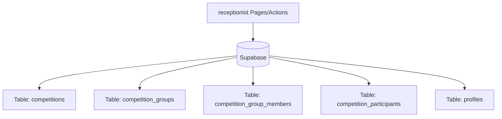

---

### REJECTION-TEMPLATES

**Files connected/used:**
- `app/(dashboard)/rejection-templates/_components/template-columns.tsx`
- `app/(dashboard)/rejection-templates/_components/template-dialogs.tsx`
- `app/(dashboard)/rejection-templates/_hooks/use-templates-table.ts`
- `app/(dashboard)/rejection-templates/actions.ts`
- `app/(dashboard)/rejection-templates/page.tsx`
- `app/(dashboard)/rejection-templates/template-table.tsx`

*No direct Supabase `.from()` usage detected in this directory. It might rely on APIs, context, or hooks from other directories.*

---

### REPORTS

**Files connected/used:**
- `app/(dashboard)/reports/[id]/page.tsx`
- `app/(dashboard)/reports/_components/report-columns.tsx`
- `app/(dashboard)/reports/_components/report-dialogs.tsx`
- `app/(dashboard)/reports/_hooks/use-reports-table.ts`
- `app/(dashboard)/reports/actions.ts`
- `app/(dashboard)/reports/page.tsx`
- `app/(dashboard)/reports/report-table.tsx`

**Supabase Connections:**
- **Tables:** reports, profiles
- **Columns Selected/Manipulated:** id, username, email, fullname, avatar_url, status, *, messages

**Illustration (DB Connection):**
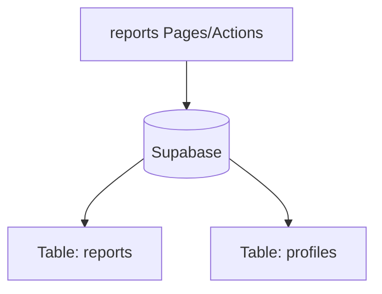

---

### SETTINGS

**Files connected/used:**
- `app/(dashboard)/settings/_components/system-status-card.tsx`
- `app/(dashboard)/settings/page.tsx`
- `app/(dashboard)/settings/profile/page.tsx`
- `app/(dashboard)/settings/security/page.tsx`

*No direct Supabase `.from()` usage detected in this directory. It might rely on APIs, context, or hooks from other directories.*

---

### SUBSCRIPTIONS

**Files connected/used:**
- `app/(dashboard)/subscriptions/_components/subscription-columns.tsx`
- `app/(dashboard)/subscriptions/_hooks/use-subscriptions-table.ts`
- `app/(dashboard)/subscriptions/actions.ts`
- `app/(dashboard)/subscriptions/page.tsx`
- `app/(dashboard)/subscriptions/subscriptions-table.tsx`

*No direct Supabase `.from()` usage detected in this directory. It might rely on APIs, context, or hooks from other directories.*

---

### SUPPORT

**Files connected/used:**
- `app/(dashboard)/support/dashboard/page.tsx`

*No direct Supabase `.from()` usage detected in this directory. It might rely on APIs, context, or hooks from other directories.*

---

### TRASH-BIN

**Files connected/used:**
- `app/(dashboard)/trash-bin/_components/trash-dialogs.tsx`
- `app/(dashboard)/trash-bin/_components/trash-group-columns.tsx`
- `app/(dashboard)/trash-bin/_components/trash-quiz-columns.tsx`
- `app/(dashboard)/trash-bin/_components/trash-user-columns.tsx`
- `app/(dashboard)/trash-bin/_hooks/use-trash-table.ts`
- `app/(dashboard)/trash-bin/actions.ts`
- `app/(dashboard)/trash-bin/page.tsx`
- `app/(dashboard)/trash-bin/trash-bin-tabs.tsx`
- `app/(dashboard)/trash-bin/trash-group-table.tsx`
- `app/(dashboard)/trash-bin/trash-quiz-table.tsx`
- `app/(dashboard)/trash-bin/trash-user-table.tsx`

**Supabase Connections:**
- **Tables:** quizzes, profiles, groups
- **Columns Selected/Manipulated:** id, title, category, questions, deleted_at, creator:profiles!creator_id(fullname, email), id, username, fullname, email, avatar_url, role, deleted_at, id, name, description, avatar_url, members, deleted_at, creator:profiles!groups_creator_id_fkey(fullname, email)

**Illustration (DB Connection):**
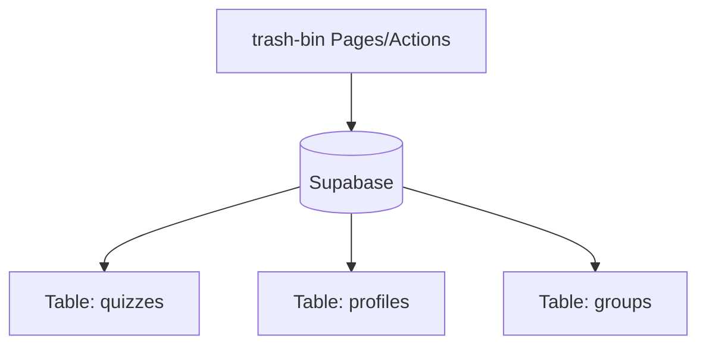

---

### USERS

**Files connected/used:**
- `app/(dashboard)/users/[id]/page.tsx`
- `app/(dashboard)/users/[id]/profile-client.tsx`
- `app/(dashboard)/users/[id]/user-detail-client.tsx`
- `app/(dashboard)/users/_components/user-columns.tsx`
- `app/(dashboard)/users/_components/user-dialogs.tsx`
- `app/(dashboard)/users/_components/user-filters.tsx`
- `app/(dashboard)/users/_components/user-table.tsx`
- `app/(dashboard)/users/_hooks/use-users-table.ts`
- `app/(dashboard)/users/actions.ts`
- `app/(dashboard)/users/page.tsx`
- `app/(dashboard)/users/user-table.tsx`

*No direct Supabase `.from()` usage detected in this directory. It might rely on APIs, context, or hooks from other directories.*

---

